# 🔌 Sentiric Connectors Service - Mantık ve Akış Mimarisi

**Belge Amacı:** Bu doküman, `connectors-service`'in Sentiric platformunun **"evrensel adaptörü"** olarak stratejik rolünü, bir isteği nasıl işlediğini ve harici dünyadaki API'ler ile `agent-service` arasında nasıl bir köprü kurduğunu açıklar.

---

## 1. Stratejik Rol: "Dış Dünya Tercümanı"

Bu servis, `agent-service`'i harici sistemlerin (CRM, Takvim, Ödeme Sistemleri vb.) karmaşıklığından tamamen soyutlar. `agent-service`, sadece soyut bir komut verir (örn: "takvime randevu ekle"); bu komutu Google Calendar'ın veya Microsoft Outlook'un anlayacağı dile çevirmek `connectors-service`'in görevidir.

**Bu servis sayesinde platform:**
1.  **Genişletilebilir Olur:** Yeni bir CRM entegrasyonu eklemek, platformun çekirdeğini değiştirmeyi değil, sadece bu servise yeni bir "konektör" modülü eklemeyi gerektirir. Bu, "Tak-Çıkar Lego Seti" felsefesinin en somut uygulamasıdır.
2.  **Güvenli Olur:** Tüm harici API anahtarları ve kimlik bilgileri, sadece bu serviste, güvenli bir şekilde saklanır. `agent-service` gibi diğer servislerin bu hassas bilgilere erişmesi gerekmez.
3.  **Dayanıklı Olur:** Harici bir API'nin (örn: Salesforce) yavaşlaması veya çökmesi, sadece bu servisi ve ilgili konektörü etkiler; platformun geri kalanının kararlılığını bozmaz.

---

## 2. Temel Çalışma Prensibi: Dinamik Yönlendirme ve Eylem Yürütme

Servis, gelen her isteği `ConnectorRegistry` adını verdiğimiz bir mekanizma ile işler.

*   **API Endpoint'i:** Servis, `/api/v1/run` adında tek ve genel bir endpoint sunar.
*   **İstek Formatı:** `agent-service`'ten gelen istek, hangi konektörün (`connector_name`) ve o konektördeki hangi eylemin (`action_name`) çalıştırılacağını, gerekli parametrelerle (`payload`) birlikte belirtir.
*   **Yönlendirme (`Routing`):** Servis, `connector_name`'e göre `ConnectorRegistry`'den doğru konektör modülünü bulur.
*   **Eylem Yürütme (`Execution`):** Bulunan konektörün içindeki `action_name`'e karşılık gelen fonksiyonu, `payload` ile birlikte çalıştırır.
*   **Sonuç Döndürme:** Konektörden gelen sonucu (başarı, hata veya veri) standart bir formatta `agent-service`'e geri döner.

---

## 3. Uçtan Uca Akış: Bir Takvim Randevusu Oluşturma

`agent-service`'in `connectors-service` aracılığıyla Google Calendar'a bir randevu eklemesi:

```mermaid
sequenceDiagram
    participant AgentService as Agent Service
    participant ConnectorsService as Connectors Service
    participant GoogleCalendar as Google Calendar Connector
    participant GoogleAPI as Google Calendar API

    AgentService->>ConnectorsService: POST /api/v1/run <br> { connector: "google_calendar", action: "create_event", payload: {...} }
    
    Note right of ConnectorsService: İsteği alır ve `ConnectorRegistry`'den <br> `google_calendar` konektörünü bulur.

    ConnectorsService->>GoogleCalendar: execute("create_event", payload)
    
    Note right of GoogleCalendar: Gelen payload'ı Google API'nin <br> anlayacağı formata çevirir ve <br> güvenli API anahtarını ekler.

    GoogleCalendar->>GoogleAPI: (OAuth 2.0 ile) <br> POST /v3/calendars/.../events
    
    GoogleAPI-->>GoogleCalendar: 200 OK (Event ID)

    GoogleCalendar-->>ConnectorsService: { success: true, data: { eventId: "..." } }
    
    ConnectorsService-->>AgentService: 200 OK <br> { success: true, data: { eventId: "..." } }
```

